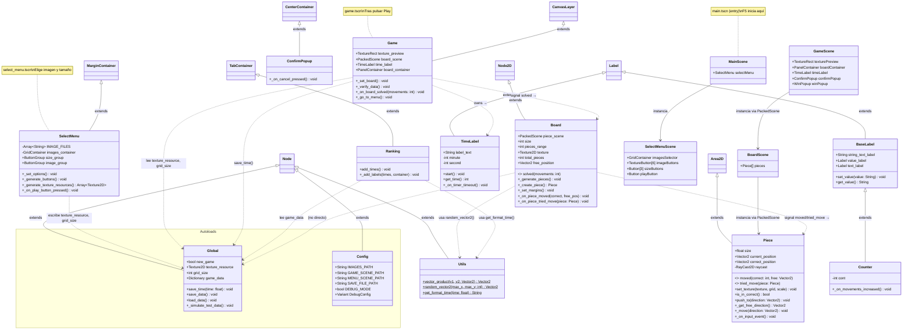

```mermaid
classDiagram
	%% ===== Inheritance =====
	Node <|-- Global : extends
	Node <|-- Config : extends
	Node <|-- Utils : extends
	Node2D <|-- Board : extends
	Area2D <|-- Piece : extends
	CanvasLayer <|-- Game : extends
	MarginContainer <|-- SelectMenu : extends
	CenterContainer <|-- ConfirmPopup : extends
	TabContainer <|-- Ranking : extends
	Label <|-- TimeLabel : extends
	Label <|-- BaseLabel : extends
	BaseLabel <|-- Counter : extends

	%% ===== Scene Composition =====
	class MainScene {
		+SelectMenu selectMenu
	}
	class SelectMenuScene {
		+GridContainer imagesSelector
		+TextureButton[6] imageButtons
		+Button[3] sizeButtons
		+Button playButton
	}
	class GameScene {
		+TextureRect texturePreview
		+PanelContainer boardContainer
		+TimeLabel timeLabel
		+ConfirmPopup confirmPopup
		+WinPopup winPopup
	}
	class BoardScene {
		+Piece[] pieces
	}

	MainScene --> SelectMenuScene : instancia
	GameScene --> BoardScene : instancia via PackedScene
	BoardScene --> Piece : instancia via PackedScene

	%% ===== Autoloads (Singletons) =====
	namespace Autoloads {
		class Global {
			+bool new_game
			+Texture2D texture_resource
			+int grid_size
			+Dictionary game_data
			+save_time(time: float) void
			+save_data() void
			+load_data() void
			+_simulate_test_data() void
		}
		class Config {
			+String IMAGES_PATH
			+String GAME_SCENE_PATH
			+String MENU_SCENE_PATH
			+String SAVE_FILE_PATH
			+bool DEBUG_MODE
			+Variant DebugConfig
		}
	}

	%% ===== Classes =====
	class SelectMenu {
		-Array~String~ IMAGE_FILES
		-GridContainer images_container
		+ButtonGroup size_group
		+ButtonGroup image_group
		+_set_options() void
		+_generate_buttons() void
		+_generate_texture_resources() Array~Texture2D~
		+_on_play_button_pressed() void
	}

	class Game {
		+TextureRect texture_preview
		+PackedScene board_scene
		+TimeLabel time_label
		+PanelContainer board_container
		+_set_board() void
		+_verify_data() void
		+_on_board_solved(movements: int) void
		+_go_to_menu() void
	}

	class Board {
		<<signal>> solved(movements: int)
		+PackedScene piece_scene
		+int size
		+int pieces_range
		+Texture2D texture
		+int total_pieces
		+Vector2 free_position
		+_generate_pieces() void
		+_create_piece() Piece
		+_set_margins() void
		+_on_piece_moved(correct, free_pos) void
		+_on_piece_tried_move(piece: Piece) void
	}

	class Piece {
		<<signal>> moved(correct: int, free: Vector2)
		<<signal>> tried_move(piece: Piece)
		+float size
		+Vector2 current_position
		+Vector2 correct_position
		-RayCast2D raycast
		+set_texture(texture, grid, scale) void
		+is_in_correct() bool
		+push_to(direction: Vector2) void
		+_get_free_direction() Vector2
		+_move(direction: Vector2) void
		+_on_input_event() void
	}

	class TimeLabel {
		+String label_text
		-int minute
		-int second
		+start() void
		+get_time() int
		+_on_timer_timeout() void
	}

	class BaseLabel {
		+String string_text_label
		+Label value_label
		+Label text_label
		+set_value(value: String) void
		+get_value() String
	}

	class Counter {
		-int cont
		+_on_movements_increased() void
	}

	class Ranking {
		+add_times() void
		+_add_labels(times, container) void
	}

	class ConfirmPopup {
		+_on_cancel_pressed() void
	}

	class Utils {
		+vector_product(v1, v2: Vector2)$ Vector2
		+random_vector2(max_x, max_y: int)$ Vector2
		+get_format_time(time: float)$ String
	}

	%% ===== Signal Connections =====
	Board ..> Piece : signal moved/tried_move →
	Game ..> Board : signal solved →
	Game ..> TimeLabel : owns →


	%% ===== Data Flow =====
	SelectMenu ..> Global : escribe texture_resource, grid_size
	Game ..> Global : lee texture_resource, grid_size
	Game ..> Global : save_time()
	Ranking ..> Global : lee game_data
	Board ..> Global : (no directo)
	Board ..> Utils : usa random_vector2()
	Ranking ..> Utils : usa get_format_time()

	%% ===== Scene Flow =====
	note for MainScene "main.tscn (entry)\nF5 inicia aquí"
	note for SelectMenu "select_menu.tscn\nElige imagen y tamaño"
	note for Game "game.tscn\nTras pulsar Play"
```
